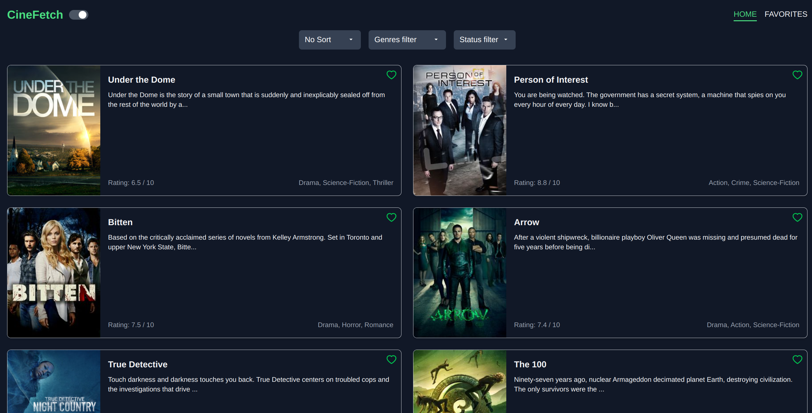
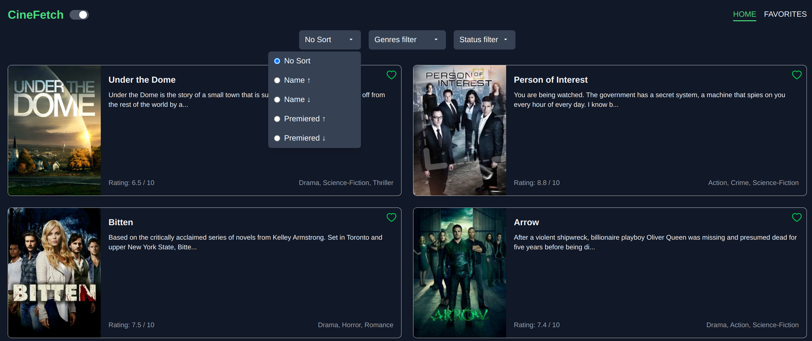
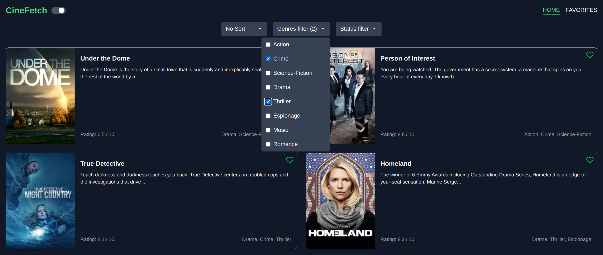
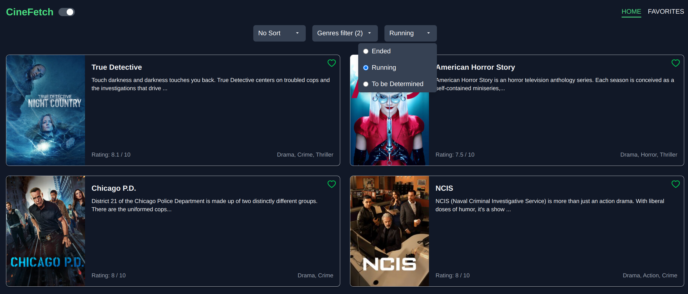

<!-- PROJECT LOGO -->

  

<h3 align="center"> CineFetch </h3>

  

    Movie Discovery App | Responsive
     
     
    <a href="https://popcornpal-webapp-7gwl.vercel.app/">View Demo</a>
    ·
    <a href="https://github.com/shpokas-io/popcornpal-webapp/issues">Report Bug</a>
    ·
    <a href="https://github.com/shpokas-io/popcornpal-webapp/issues">Request Feature</a>
  

<!-- TABLE OF CONTENTS -->

  
Table of Contents

  <ol>
    <li>
      <a href="#about-the-project">About The Project</a>
      <ul>
        <li><a href="#built-with">Built With</a></li>
      </ul>
    </li>
    <li>
      <a href="#installation">Installation</a>
    </li>
    </li>
    <li><a href="#contact">Contact</a></li>
    <!-- <li>
      <a href="#left-to-do">Left To Do</a>
    </li> -->
    <!-- <li>
      <a href="#future-development">Future development</a>
    </li> -->
  </ol>

<!-- ABOUT THE PROJECT -->

## About The Project

CineFetch is a React-based TV show browsing application that allows users to discover, filter, and save their favorite TV shows. The project leverages Tailwind CSS for styling and integrates with the TVMaze API to fetch show data.

- Responsive UI: Built with React and styled using Tailwind CSS for a modern, responsive design.
- TV Show Listings: Browse a list of TV shows fetched from the TVMaze API.
- Filtering Options:
  - Sort shows by name or premiere date.
  - Filter by genres using a multi-select dropdown.
  - Filter by show status (Ended, Running, To be Determined) with a single-select dropdown.
- Show Details: View detailed information about a selected TV show, including a clean summary, rating, and additional metadata.
- Favorites Management:
  - Toggle shows as favorites.
  - Access a dedicated favorites page to view your saved TV shows.
- Pagination: Navigate through TV shows with a pagination component.
- Theme Toggle: Switch between light and dark mode for a personalized user experience.
- Routing: Seamless navigation between Home, Favorites, and Show Details pages using React Router.
- State Management: Utilizes React Context to manage theme settings and favorites across the application.

 

(<a href="#readme-top">back to top</a>)

### Built With

##### Front end

- ![React][React]
- ![TypeScript][TypeScript]
- ![Tailwind CSS]
- ![Vite][Vite]
- ![NPM][NPM]

(<a href="#readme-top">back to top</a>)

### How to run

1. Clone the repository: 
   `git clone https://github.com/your-username/cinefetch.git
cd cinefetch`
2. Install dependencies: 
   `npm install`
3. Start development server: 
   `npm run dev`
4. Open the application: 
   `http://localhost:5173
`

### Future development

#### Known bugs

- Pagination problem, once user clicks on page 4, screen moves up for some reason.
- Once user switch to Favorite page navBar moves

## Contact

Skirmantas Spakovskis - [@LinkedIn](https://www.linkedin.com/in/skirmantasspakovskis/) - skirm.spak@gmail.com

(<a href="#readme-top">back to top</a>)

<!-- MARKDOWN LINKS & IMAGES -->
<!-- https://www.markdownguide.org/basic-syntax/#reference-style-links. -->

[NPM]: https://img.shields.io/badge/NPM-%23000000.svg?style=for-the-badge&logo=npm&logoColor=white
[Webpack]: https://img.shields.io/badge/webpack-%238DD6F9.svg?style=for-the-badge&logo=webpack&logoColor=black
[Vite]: https://img.shields.io/badge/Vite-B73BFE?style=for-the-badge&logo=vite&logoColor=FFD62E
[JavaScript]: https://img.shields.io/badge/javascript-%23323330.svg?style=for-the-badge&logo=javascript&logoColor=%23F7DF1E
[React]: https://img.shields.io/badge/React-%2361DAFB.svg?style=for-the-badge&logo=react&logoColor=white
[HTML5]: https://img.shields.io/badge/html5-%23E34F26.svg?style=for-the-badge&logo=html5&logoColor=white
[CSS3]: https://img.shields.io/badge/css3-%231572B6.svg?style=for-the-badge&logo=css3&logoColor=white
[Parcel]: https://img.shields.io/badge/Parcel-%23B93C00.svg?style=for-the-badge&logo=parcel&logoColor=white
[SCSS]: https://img.shields.io/badge/SCSS-%23CC6699.svg?style=for-the-badge&logo=sass&logoColor=white
[Webpack]: https://img.shields.io/badge/Webpack-8DD6F9?style=for-the-badge&logo=webpack&logoColor=white
[ASP.NET Core]: https://img.shields.io/badge/ASP.NET%20Core-%230078D7.svg?style=for-the-badge&logo=aspnetcore&logoColor=white
[Tailwind CSS]: https://img.shields.io/badge/Tailwind%20CSS-%2338B2AC.svg?style=for-the-badge&logo=tailwindcss&logoColor=white
[Entity Framework Core]: https://img.shields.io/badge/Entity%20Framework%20Core-%23094E9C.svg?style=for-the-badge&logo=dotnet&logoColor=white
[NestJS]: https://img.shields.io/badge/NestJS-E0234E.svg?style=for-the-badge&logo=nestjs&logoColor=white
[Redux]: https://img.shields.io/badge/Redux-764ABC.svg?style=for-the-badge&logo=redux&logoColor=white
[MaterialUI]: https://img.shields.io/badge/Material%20UI-0081CB.svg?style=for-the-badge&logo=mui&logoColor=white
[TypeScript]: https://img.shields.io/badge/TypeScript-3178C6.svg?style=for-the-badge&logo=typescript&logoColor=white
[Supabase]: https://img.shields.io/badge/Supabase-3ECF8E.svg?style=for-the-badge&logo=supabase&logoColor=white
[Node.js]: https://img.shields.io/badge/Node.js-339933.svg?style=for-the-badge&logo=nodedotjs&logoColor=white
[JWT]: https://img.shields.io/badge/JWT-000000.svg?style=for-the-badge&logo=jsonwebtokens&logoColor=white
[product-screenshot]: public/images/prev.png
